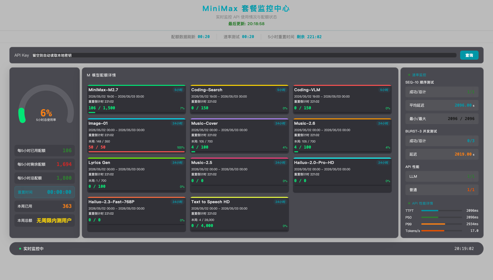

# MiniMax Package Monitor

[中文版](./README_zh.md)

Real-time local dashboard for monitoring MiniMax API package usage — quota tracking, on-demand rate probing, weekly usage, and 24h history.

> **Current Version: v1.7.0** | [CHANGELOG](CHANGELOG.md) | [License](LICENSE)




---

## Features (v1.7.0)

### Quota Monitoring

- 📊 **4-hour / 24-hour / weekly** usage windows — primary ring chart shows the user's actual Token Plan cycle
- 🎯 **Per-model cards** distinguish 4h-capped / 24h-capped / no-weekly-limit / plan-not-enabled (video) cases
- 📈 **24-hour trend line** from local `history.jsonl` ring buffer

### Rate Probing (on-demand)

- ⚡ **TTFT / P50 / burst / token·s** measurements from real chat completion requests
- ⚠️ **Button-only with confirm() dialog** — costs ~180 tokens per click, never fires automatically

### Security

- 🔒 **Credential loaded on demand, never cached** — Server does **not** auto-read `~/.mmx/config.json` and does **not** cache the key in process memory (v1.7.0+). Dashboard's "加载本地凭证" button + `confirm()` triggers `POST /api/load_cred` which authorizes the server to re-read the key from disk on every request. `lldb memory find` on the server process shows no key in writable memory regions.
- 🔒 **`/api/load_cred` response excludes the full key** — returns `keyLength` + `keyPrefix` (first 6 chars) only
- 🔒 **`/api/load_cred` rejects empty `Referer`** — must come from a local-origin page (`127.0.0.1 / localhost / file://`)
- 🔒 **CORS allowlist** — only `127.0.0.1 / localhost / file://` can reach the local server
- 🔒 **No remote key transmission** — API key never leaves the local machine

---

## Quick Start

### Prerequisites

- Node.js ≥ 18

### Run

```bash
# 1. Start backend service
node mmx-monitor-server.js

# 2. Open browser (macOS auto-opens http://127.0.0.1:9877/)
open http://127.0.0.1:9877/
# Windows / Linux: navigate to http://127.0.0.1:9877/ manually
```

### Load API Key

After the page loads, click **"加载本地凭证"** button → confirm → server is authorized to read `~/.mmx/config.json` on demand. The key is read fresh on every `/api/token_plan` / `/api/probe` call, used, then discarded by GC (never cached in process memory). Or paste your key directly into the input box for `--allow-header-key` mode.

---

## Startup Options

```bash
# Default
node mmx-monitor-server.js

# Enable X-MMX-API-Key header passthrough (advanced)
node mmx-monitor-server.js --allow-header-key

# Disable /api/probe endpoint entirely (no inference calls)
node mmx-monitor-server.js --no-probe
```

---

## Configuration

### mmx Local Config (on-demand, never cached)

The backend **does not auto-read** `~/.mmx/config.json` and **does not cache** the key in process memory. Use the dashboard's **"加载本地凭证"** button to authorize on-demand reads of `~/.mmx/config.json` (read on every request, used, discarded). The key is never held in process memory and is never written to disk or returned in HTTP responses.

### Environment Variable (fallback)

If `~/.mmx/config.json` is not present:

```bash
# Copy template
cp .env.example .env

MINIMAX_API_KEY=sk-cp-…here           # MiniMax API Key (Token Plan type)
```

---

## Security & Data Flow

**This service, by default, will**:

1. **Load local credentials on demand, never cached** — Dashboard's "加载本地凭证" button triggers `POST /api/load_cred` which authorizes the server to read `~/.mmx/config.json` fresh on every credentialed request (v1.7.0+). The key is never held in process memory between calls — verified by `lldb memory find` showing no key in the server process. Not returned in any HTTP response.
2. **Poll MiniMax API every 60s** — `https://www.minimaxi.com/v1/token_plan/remains` for quota data.
3. **Write local usage samples** — `<skill-dir>/history.jsonl` is appended on each quota poll (24h ring buffer, contains usage percentages only, no credentials).
4. **Run inference probe on user demand only** — Dashboard button + `confirm()` triggers `/api/probe` (5 chat completion requests, ~180 tokens).

**This service will NOT**:

- Auto-read `~/.mmx/config.json` on startup.
- Cache the API key in process memory between requests (v1.7.0+).
- Return the API key in any HTTP response body.
- Accept empty `Referer` for credential-loading requests.
- Allow cross-origin web pages to reach the local server.
- Run the inference probe automatically or on a timer.

---

## API Endpoints

| Endpoint | Description |
|----------|-------------|
| `POST /api/load_cred` | Authorize server to read `~/.mmx/config.json` on demand (user-clicks-button, confirm dialog required; does NOT cache key in memory) |
| `GET /api/token_plan` | Fetch quota from MiniMax official (reads key fresh from disk on each call) |
| `GET /api/probe` | On-demand API latency probe (user-clicks-button, confirm dialog, reads key fresh from disk) |
| `GET /api/history?hours=24` | 24h usage history from local ring buffer |
| `GET /health` | Health check |

---

## File Overview

| File | Description |
|------|-------------|
| `mmx-monitor.html` | Monitoring page (single-file HTML frontend) |
| `mmx-monitor-server.js` | Local proxy service (Node.js, port 9877) |
| `history.jsonl` | 24h usage history ring buffer (auto-generated, gitignored) |
| `SKILL.md` | Agent skill definition |
| `CHANGELOG.md` | Full version history |
| `demo.png` | Dashboard screenshot |
| `LICENSE` | MIT License |

---

## FAQ

**Q: Shows "Connection Failed" after clicking Query?**
A: Make sure the backend service is running (`node mmx-monitor-server.js`).

**Q: Port 9877 already in use?**
A: Stop the process using that port, or modify the `PORT` constant in `mmx-monitor-server.js`.

---

## License

MIT License — see [LICENSE](LICENSE).
